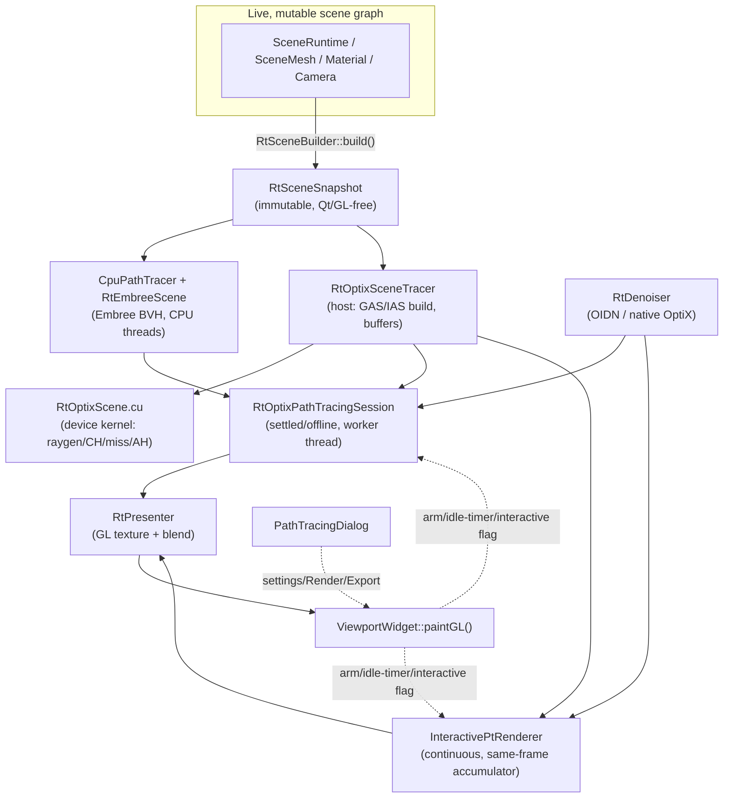

# ModelViewer-Qt Path Tracer — Complete Architecture Guide

This is a from-scratch walkthrough of the entire path-tracing subsystem: two
independent rendering backends (CPU/Embree, GPU/OptiX) that share one scene
representation, three session/presentation classes that decide *when* and
*how* a frame gets shown, and a Qt orchestration layer that wires it all to
the viewport and the settings dialog. All file paths are relative to the
repo root; all line numbers reflect the code as read during this walkthrough
and will drift as the code evolves — treat them as "look here first," not
gospel.



---

## 1. The shared scene data model

Both backends consume the exact same intermediate representation, built once
per revision by `RtSceneBuilder::build()`. This is the seam that keeps the
two path tracers honest with each other — if they disagree, it's because
one of them mis-implements a shared piece of data, not because they were
each looking at slightly different scenes.

### 1.1 `RtSceneSnapshot` — [`include/RtSceneSnapshot.h:749-778`](include/RtSceneSnapshot.h:749)

Its own doc comment ([`RtSceneSnapshot.h:10-23`](include/RtSceneSnapshot.h:10)) states the purpose directly: an **immutable, Qt/GL-free flattened copy of the scene**, built once per revision, so CPU worker threads never touch the live, mutable scene graph directly — no locking, no risk of reading half-updated state mid-trace. Camera movement alone does *not* rebuild a snapshot; it only resets accumulation.

```cpp
struct RtSceneSnapshot
{
    std::vector<RtMeshGeometry> meshes;
    std::vector<RtInstance>     instances;
    std::vector<RtMaterial>     materials;
    std::vector<RtLight>        lights;
    RtCamera                    camera;
    RtEnvironment                environment;
    RtInfinitePlane               infinitePlane;
    bool shadowsEnabled     = true;
    bool selfShadowsEnabled = true;
    uint64_t revisionId = 0;   // bumped every rebuild - lets tracers detect "actually changed" vs "camera moved"
};
```

One mesh → one `RtMeshGeometry` + one `RtInstance` — v1 deliberately doesn't
dedupe identical geometry shared by multiple instances, since `SceneMesh`
already owns a full private vertex copy per instance
([`RtSceneSnapshot.h:51-58`](include/RtSceneSnapshot.h:51)).

### 1.2 `RtMeshGeometry` — per-vertex data ([`RtSceneSnapshot.h:59-196`](include/RtSceneSnapshot.h:59))

Base geometry: `vertices` (a flat `RtVertex` array) + `indices` (triangle
list). `RtVertex` ([`:30-49`](include/RtSceneSnapshot.h:30)) carries position, normal, **4** UV
channels (glTF texCoord extensions can reference any of them), vertex color,
tangent, bitangent.

Two extra "enrichment" blocks exist purely so the **GPU** backend can animate
geometry without re-uploading full vertex buffers every frame:

- **GPU skinning** ([`:131-139`](include/RtSceneSnapshot.h:131)): bind-pose positions/normals/tangents,
  per-vertex joint indices/weights, and the current joint-matrix palette.
- **GPU morph targets** ([`:183-195`](include/RtSceneSnapshot.h:183)): rest-pose arrays plus flattened
  per-target delta arrays (target-major: `target * vertexCount + i`) and the
  current morph weights.

Identity/caching fields ([`:95-96`](include/RtSceneSnapshot.h:95)):

```cpp
uint32_t sourceObjectId = 0;   // hash of the mesh's stable QUuid — NOT a positional index
uint64_t contentHash = 0;      // hash of the FINAL post-skin/post-morph vertices+indices
```

This distinction is the single most-referenced "why" in the whole codebase
for GAS caching (§3.3) — using a positional index instead of a UUID hash
once caused a real, logged bug: deleting-then-undoing 3 unrelated objects
spuriously cache-missed ~100 unrelated meshes' worth of GPU acceleration
structures, because every later mesh's *index* shifted
([`RtSceneSnapshot.h:78-89`](include/RtSceneSnapshot.h:78)).

### 1.3 `RtMaterial` — every field ([`RtSceneSnapshot.h:283-560`](include/RtSceneSnapshot.h:283))

One struct carries the entire shading vocabulary both backends implement.
Grouped by extension:

| Group | Fields | Lines |
|---|---|---|
| Core PBR | `baseColor`, `metalness`, `roughness`, `emissive`, `emissiveStrength`, `opacity`, `unlit`, `blendMode`, `alphaThreshold`, `twoSided` | 285-323 |
| Specular-glossiness (legacy) | `useSpecGloss`, `diffuseColor`, `specGlossSpecularColor`, `glossinessFactor` | 335-338 |
| KHR_materials_ior / specular | `ior`, `specularFactor`, `specularColorFactor` (+ textures) | 349-394 |
| KHR_materials_clearcoat | `clearcoat`, `clearcoatRoughness` (+ textures/normal) | 401-406 |
| KHR_materials_sheen | `sheenColor`, `sheenRoughness` (+ textures) | 418-421 |
| KHR_materials_anisotropy | `anisotropyStrength`, `anisotropyRotation` (+ texture) | 430-432 |
| KHR_materials_iridescence | `iridescenceFactor`, `iridescenceIor`, thickness min/max (+ textures) | 443-448 |
| KHR_materials_transmission/volume/dispersion | `transmission`, `hasVolume`, `attenuationColor`, `attenuationDistance`, `dispersion` | 467-492 |
| KHR_materials_volume_scatter | `multiScatterColor`, `hasVolumeScattering` | 504-505 |
| Shadow catcher (floor-only) | `isShadowCatcher`, `shadowCatcherDarkness/baseColor/metalness/roughness` | 538-542 |
| KHR_materials_diffuse_transmission | `diffuseTransmissionFactor`, `diffuseTransmissionColor` (+ textures) | 556-559 |

Every texture slot is an `RtTextureSample` ([`:212-273`](include/RtSceneSnapshot.h:212)): decoded RGBA8 pixels, a
box-filtered mip pyramid, UV transform, channel-packing metadata, wrap
modes, and an `imageCacheKey` (`QImage::cacheKey()`) used for cross-snapshot
texture dedup on the GPU side (§3.5).

### 1.4 Environment and floor

`RtEnvironment` ([`:659-747`](include/RtSceneSnapshot.h:659)) is a **CPU-resident readback of the actual GPU
cubemap texture** the raster skybox samples — not a re-cache of the source
HDR file — guaranteeing both tracers match whatever raster currently shows,
regardless of load format ([`:645-658`](include/RtSceneSnapshot.h:645)). It carries the sharp cubemap
(`faces[6]`), a diffuse-irradiance-convolved cubemap, a GGX-prefiltered
specular mip chain, a sheen-prefiltered variant, exposure, and skybox
rotation/up-axis state.

`RtInfinitePlane` ([`:636-643`](include/RtSceneSnapshot.h:636)) is a **procedural analytic ground plane**
intersected via world-space ray/plane math directly by both tracers — not
backed by any mesh/GL resource, and truly infinite (unlike the raster
floor's finite quad). The shadow-catcher *behavior* itself lives on the
floor's own `RtMaterial` fields (§1.3), set only by
`RtSceneBuilder::convertFloorMaterial()`.

### 1.5 `RtSceneBuilder::build()` — the main entry point ([`src/RtSceneBuilder.cpp:826-938`](src/RtSceneBuilder.cpp:826))

```cpp
std::shared_ptr<RtSceneSnapshot> RtSceneBuilder::build(
    const SceneRuntime& runtime, const Camera& camera, float aspectRatio,
    const std::vector<GPULight>& lights, uint64_t revisionId,
    const RtEnvironment* environment, const RtFloorParams* floor,
    bool shadowsEnabled, bool selfShadowsEnabled);
```

Steps, in order:

1. Allocate snapshot, stamp `revisionId`/shadow flags (`:837-840`).
2. Enumerate **all** currently-visible mesh ids — deliberately *not*
   frustum-culled, since a path-traced ray can hit geometry currently
   outside the raster frustum after a bounce (`:842-850`).
3. Per mesh: `convertGeometry()` (`:115-335`, builds vertices/indices +
   applies CPU skinning bake + captures GPU enrichment arrays), assign
   `sourceObjectId = qHash(mesh->uuid())` (`:888`), compute `contentHash`
   via chained FNV-1a over indices then vertices (`:893-894`),
   `convertMaterial()` (`:499-636`), build the `RtInstance` (`:898-902`).
4. Floor/shadow-catcher: `fillInfinitePlane()` always builds the analytic
   plane's material (`:701-713`); `addFloorInstance()` additionally adds a
   real synthetic quad **unless** shadow-catcher mode is active, in which
   case only the analytic infinite plane is used (`:905-915`).
5. Lights flattened from `GPULight` → `RtLight` (`:917-930`).
6. Camera built by reading the **projection matrix's own `[1][1]` element**
   rather than re-deriving FOV — prevents primary rays from silently
   drifting out of sync with `Camera::updateProjectionMatrix()`'s "Hor+"
   logic, cited as the fix for a real "model renders too small" bug
   (`:796-824`, doc comment [`RtSceneSnapshot.h:608-615`](include/RtSceneSnapshot.h:608)).
7. Environment copied through as-is (`:934-935`) — the actual cubemap
   capture happens upstream in `SceneRenderController`.

### 1.6 Content hashing, in one place

| Hash | Computed at | Hashes over | Used by |
|---|---|---|---|
| `sourceObjectId` | `RtSceneBuilder.cpp:888` | `qHash(mesh->uuid())` | GAS cache key (identity, stable across index shifts) |
| `contentHash` | `RtSceneBuilder.cpp:893-894` | final post-skin/morph indices+vertices | GAS cache hit/miss (did geometry actually change) |
| `baseContentHash` | `RtSceneBuilder.cpp:302-315` | bind-pose data, **excludes** joint palette | persistent GPU-skin bind-pose cache |
| `morphBaseContentHash` | `RtSceneBuilder.cpp:317-332` | rest-pose + delta arrays, **excludes** weights | persistent GPU-morph base cache |
| `imageCacheKey` | `RtSceneBuilder.cpp:439/492` | `QImage::cacheKey()` | GPU texture dedup cache |

The `fnv1aHash()` helper ([`RtSceneBuilder.cpp:20-38`](src/RtSceneBuilder.cpp:20)) is explicitly *not*
cross-run stable — it only needs determinism within one process, since
nothing persists these hashes across restarts.

---

## 2. The CPU path tracer (`CpuPathTracer` + `RtEmbreeScene`)

### 2.1 Entry point ([`include/CpuPathTracer.h:160-170`](include/CpuPathTracer.h:160))

```cpp
void renderPass(const RtEmbreeScene& scene, const RtSceneSnapshot& snapshot,
    const RtEnvironmentSampler& envSampler, int width, int height,
    uint32_t sampleSeed, std::vector<glm::vec3>& outRadiance,
    const std::atomic<bool>* cancelFlag = nullptr,
    std::vector<float>* outPrimaryHitMask = nullptr,
    std::vector<glm::vec3>* outPrimaryAlbedo = nullptr,
    std::vector<glm::vec3>* outPrimaryNormal = nullptr) const;
```

One call = one noisy 1-sample-per-pixel pass, linear HDR, un-tonemapped.
The caller (`RtFrameAccumulator`/`RtOptixPathTracingSession`'s CPU-equivalent)
averages many passes together — averaging is explicitly *not*
`CpuPathTracer`'s job ([`CpuPathTracer.h:26-29`](include/CpuPathTracer.h:26)).

Class doc comment ([`CpuPathTracer.h:14-45`](include/CpuPathTracer.h:14)): unidirectional path tracing with
NEE against `snapshot.lights` using the exact glTF `KHR_lights_punctual`
attenuation ported from `evaluatePunctualLight()` in `main_scene.frag`, plus
BSDF-sampled indirect bounces terminated by Russian roulette — Cook-Torrance
D/G/F terms are ported from the *same shader* so path-traced and raster PBR
agree at rest.

### 2.2 `tracePixel()` — the per-pixel bounce loop ([`src/CpuPathTracer.cpp:2563`](src/CpuPathTracer.cpp:2563))

```cpp
while (true)
{
    if (bounce > settings.maxBounces)
        break;
    const RtHit meshHit = scene.intersect(ray);
    ...
```
([`:2702-2707`](src/CpuPathTracer.cpp:2702))

Three independent depth counters run in parallel ([`:2687-2700`](src/CpuPathTracer.cpp:2687)): `bounce`
(ordinary), `transmissionDepth` (glass/TIR chains, capped by
`maxTransmissionBounces`), `scatterBounces` (volume-scatter free flight,
capped by `maxVolumeScatterBounces`).

`radiance`/`throughput` accumulate the usual way (`radiance +=
throughput * <BRDF*Li>`); Russian roulette kicks in once
`bounce + transmissionDepth >= russianRouletteStartDepth`:

```cpp
if (bounce + transmissionDepth >= settings.russianRouletteStartDepth)
{
    const float p = std::clamp(std::max({throughput.r, throughput.g, throughput.b}), 0.05f, 1.0f);
    if (rng.next01() > p) break;
    throughput /= p;
}
```
([`:3743-3749`](src/CpuPathTracer.cpp:3743) — volume-scatter has its own separate RR at `:2909-2915`)

### 2.3 NEE + MIS

- **Punctual-light NEE**: loop over `snapshot.lights` ([`:3524-3659`](src/CpuPathTracer.cpp:3524)), shadow
  rays via `traceShadowRay()` ([`:2274-2382`](src/CpuPathTracer.cpp:2274), alpha/transmission/
  diffuse-transmission-aware occlusion walk, capped at `maxShadowRayHits`).
- **Environment NEE**: [`:3661-3734`](src/CpuPathTracer.cpp:3661) — importance-samples the HDRI via
  `envSampler.sample()`, traces a shadow ray, MIS-weights with the balance
  heuristic: `misWeight = envPdf / (envPdf + bsdfPdf)` where `bsdfPdf` comes
  from `evaluateBsdfPdf()` ([`:1978`](src/CpuPathTracer.cpp:1978)).
- **The other half of MIS** (BSDF-sampled bounce escaping to environment):
  weighted by `lastBsdfSamplePdf / (lastBsdfSamplePdf + envPdf)` when a
  BSDF-sampled ray misses geometry — set up right after each
  `sampleBSDFBounce()` call ([`:4081`](src/CpuPathTracer.cpp:4081), bookkeeping `:4132-4141`). A perfect-mirror
  lobe deliberately skips MIS (full weight instead), since a finite pdf is
  meaningless for an exact delta direction ([`:4103-4131`](src/CpuPathTracer.cpp:4103)).

### 2.4 Feature locations

| Feature | Function | Location |
|---|---|---|
| Clearcoat direct | `evaluateClearcoatDirect()` | `:1561-1579` |
| Clearcoat bounce lobe | inline in `sampleBSDFBounce()` | `:2078-2126` |
| Sheen (Charlie NDF + LUTs) | `calculateSheen()`, `sheenAlbedoLUT()` | `:1659-1673`, `:1728` |
| Anisotropic GGX D/V | `distributionGGXAnisotropic()`, `visibilityGGXAnisotropic()` | `:1201`, `:1209` |
| Iridescence (thin-film Fresnel) | `evalIridescence()`, `applyIridescenceToFresnel()` | `:1273-1332`, `:1346` |
| Transmission/volume/dispersion | inline block, `surf.transmission > 0.001f` | `:3772-4078` (dispersion `:3931-3970`) |
| Volume-scatter free-flight walk | inline block + `computeVolumeScatterCoefficients()` | `:2864-2932`, `:1398` |
| Shadow catcher | `mat.isShadowCatcher` branch (port of NVIDIA vk_gltf_renderer) | `:3037-3208` |
| `diffuse_transmission` (NEE + bounce) | back-hemisphere NEE branch + `sampleBSDFBounce()` branch | `:3532-3585`, `:2205-2228` |

Note: a closed-form BSSRDF diffusion-profile importance sampler was tried
and **removed** — the current transmission code instead blends the
refracted direction toward a cosine-weighted hemisphere sample with
probability `sqrt(roughness)` as an approximation for frosted/rough glass
([`:4009-4053`](src/CpuPathTracer.cpp:4009), comment at `:4093-4095`). The full
story of why BSSRDF came and went, and what replaced it, is §2.6.

### 2.5 `RtEmbreeScene` — the BVH

Two-level BVH: one BLAS `RTCScene` per unique mesh, one TLAS `RTCScene` made
of `RTC_GEOMETRY_TYPE_INSTANCE` geometries applying each `RtInstance`'s
world transform ([`include/RtEmbreeScene.h:18-33`](include/RtEmbreeScene.h:18)).

- `build()` ([`:48`](include/RtEmbreeScene.h:48)) — only re-run when geometry/instances actually change.
- `intersect()` ([`:52`](include/RtEmbreeScene.h:52), impl [`src/RtEmbreeScene.cpp:112-243`](src/RtEmbreeScene.cpp:112)) — closest-hit query,
  reconstructs world-space position/normal/tangent/UV/material-index from
  the hit triangle.
- `occluded()` ([`:56`](include/RtEmbreeScene.h:56)) exists but `CpuPathTracer` never calls it —
  shadow rays go through `traceShadowRay()`'s own closest-hit walk instead,
  because shadow rays need to see *what* they hit to accumulate tinted
  transmittance through glass/alpha-tested/diffuse-transmissive surfaces, a
  plain any-hit query can't give that ([`RtEmbreeScene.cpp:133-141`](src/RtEmbreeScene.cpp:133)).

### 2.6 Volume-scatter and BSSRDF: the full history

`KHR_materials_volume_scatter` asks for something genuinely harder than
every other extension in §2.4: real light transport *inside* a translucent
medium (wax, skin, marble, the `ScatteringSkull.gltf` conformance asset),
not just a surface BSDF term. This codebase went through three real
implementation attempts before landing on the one that's in the tree today.
Git history for the curious: `git log --oneline --grep=BSSRDF -i` and
`--grep="volume.scatter" -i`.

**Attempt 1 — an early free-flight random-walk prototype.** Existed
briefly, then was removed (task history calls it "Remove random-walk
volume-scatter code (CPU+GPU)"). Its own commit message doesn't survive in
this branch's log in detail, but the commit that replaced it
([`da7fd27`](src/CpuPathTracer.cpp)) describes it only as a prototype being
replaced — the real design rationale only shows up starting with attempt 2.

**Attempt 2 — BSSRDF diffusion-profile importance sampling** (commit
`da7fd27`, "Implement KHR_materials_volume_scatter via BSSRDF
diffusion-profile sampling"). This is a real, textbook BSSRDF: Christensen &
Burley 2015 "normalized diffusion," following PBRT's `Sample_Sp`/`Pdf_Sp`
structure — pick a spectral channel and projection axis (uniform 1/3 each),
sample a radius from the Burley CDF, probe-trace outward to find an entry
point elsewhere on the surface, evaluate a combined MIS pdf across all 3
axes × 3 channels. Implemented identically on CPU
(`sampleBSSRDFEntryPoint()` in `CpuPathTracer.cpp`) and GPU (the same
function in `RtOptixScene.cu`, using a nested `optixTrace()` for the probe).

Extensive CPU/GPU parity debugging along the way fixed several real bugs
(a missing `diffuseTransmissionColor` tint on GPU, CPU using the raw instead
of face-forward-corrected normal for entry-point sampling, a V/N
self-consistency gap right after a GPU redirect). But even after all of
that, GPU's result for `ScatteringSkull.gltf` still read visibly
brighter/flatter than CPU's, with no third-party reference implementation
(neither Disney's dspbr-pt nor RayTrophi implement this specific glTF
extension) to validate which engine's magnitude was "more correct." The
commit message is candid about this being left as a known, lower-priority
open item rather than continuing to chase parity — a good example of
choosing to ship forward progress over an unresolved cosmetic discrepancy.

**Attempt 2's deeper problem, discovered later:** the closed-form Burley
approach fixed the *first* prototype's variance problems, but it only ever
modeled **lateral** subsurface diffusion — light entering and re-emerging
near the same point on a surface. It had no way to represent light glowing
**through** a thin shell front-to-back (exactly what a hollow skull's thin
cranium needs to look right), and its hue — driven directly off
`multiScatterColorFactor` — visibly diverged from NVIDIA's own
`vk_gltf_renderer` reference render.

**Attempt 3 (current) — a genuine free-flight random walk** (commit
`286cad5`, "Replace CPU BSSRDF diffusion-profile SSS with a genuine
free-flight random walk"). This is not a diffusion approximation at all —
it's real per-segment stochastic scatter/absorb simulation, porting
NVIDIA's exact reference formulas:

- **Kulla-Conty single-scatter albedo recovery** ([`CpuPathTracer.cpp:1372-1383`](src/CpuPathTracer.cpp:1372),
  `multiToSingleScatterAlbedo()`) — Kulla & Conty Estevez 2017's polynomial
  fit recovering a *single*-scatter albedo from the glTF extension's
  *multi*-scatter target color, ported verbatim from NVIDIA's
  `gltf_material_eval.h.slang:125-129`.
- **Additive extinction** ([`:1385-1407`](src/CpuPathTracer.cpp:1385), `computeVolumeScatterCoefficients()`) —
  a deliberate divergence from the old BSSRDF's usage of `attenuationColor`/
  `attenuationDistance` as `sigma_t` directly: here the scatter coefficient
  is **added on top of** the absorption-only coefficient rather than split
  out of it, so a volume-scatter material's real extinction ends up higher
  than `attenuationColor` alone would suggest — matching NVIDIA's reference
  hue instead of the previous BSSRDF's blue/cyan-vs-green mismatch.
- **Henyey-Greenstein phase function** ([`:1409-1451`](src/CpuPathTracer.cpp:1409),
  `sampleHenyeyGreenstein()`/`henyeyGreensteinPdf()`) — standard PBRT-style
  phase sampling, currently always called with `g=0` (isotropic), since
  `KHR_materials_volume_scatter` has no anisotropy factor anywhere in this
  codebase's material pipeline yet; kept general so a future anisotropy
  factor doesn't need another rewrite.
- **The per-segment free-flight walk itself** ([`:2864-2932`](src/CpuPathTracer.cpp:2864), inside
  `tracePixel()`'s `hitBackface && surf.hasVolume` gate) — for each segment
  of travel inside the medium, a scatter distance is drawn from the
  extinction coefficient (`-log(rand)/maxExtinction`); if that distance
  lands short of the segment's actual length, the ray never reaches the
  surface hit at all — it's redirected mid-segment via
  `sampleHenyeyGreenstein()`, an NEE sample is taken from that interior
  point (`sampleVolumeScatterNEE()`, [`:2406`](src/CpuPathTracer.cpp:2406)), and the loop `continue`s,
  skipping every bit of ordinary surface shading (alpha test, BSDF lobes,
  surface NEE) for this iteration. A **64-bounce free budget**
  (`settings.maxVolumeScatterBounces`, user-configurable, exposed via the PT
  dialog) runs before Russian roulette (`kVolumeRrCap = 0.95f`,
  [`:54`](src/CpuPathTracer.cpp:54)) starts probabilistically terminating the walk.
- **Debug view**: `kDebugVisualizeVolumeScatterBounces`
  ([`:4175-4190`](src/CpuPathTracer.cpp:4175)) — same heat-ramp visualization pattern used for transmission
  bounce count, over the final `scatterBounces` value.

Confirmed against `ScatteringSkull.gltf` — this is the version that's live
in the tree today; there is no BSSRDF code left in the codebase at all.

**GPU port** (commit `649f4b7`, "Port the free-flight volume-scatter random
walk to the GPU path tracer") mirrors the CPU implementation exactly
(same Kulla-Conty recovery, same additive extinction, same 64-bounce free
budget), but along the way uncovered a **GPU-only bug that CPU could never
have had**: `__anyhit__ah()`'s single-sided backface-culling gate
(`solidVolumeExitCandidate` in `RtOptixScene.cu`) was written to let a ray
pass through a backface only for materials with real specular
`KHR_materials_transmission` (`transmission > 0.001f`). But
`ScatteringSkull.gltf` is single-sided, diffuse-transmission-only, with
**no** specular transmission at all — its medium is entered through
`KHR_materials_diffuse_transmission`'s back-hemisphere lobe instead. Every
one of its interior/backface hits was being silently discarded by the
any-hit shader *before* `__closesthit__ch()` ever ran, meaning
`hitBackface` could never become true and the free-flight walk could never
execute — a total feature failure with no error, just a wrong-looking
render. Found via a temporary debug view that colored any hit where
`hasVolume`/`hasVolumeScattering` read true, decoupled from `hitBackface` —
it showed the flags correct everywhere except this material's own backface
hits, isolating the bug to the any-hit cull stage specifically (CPU has no
equivalent any-hit culling stage, so it had already independently proven
the material *data* itself was correct). The fix: extend the pass-through
condition to `data->transmission > 0.001f || data->hasVolumeScattering != 0`
(`RtOptixScene.cu`, inside `__anyhit__ah()`). Confirmed matching CPU's
render after the fix — this is the version live in the GPU kernel today,
using the same `kVolumeScatterEscapeSentinel = -7.0f` tag (§4.5's family of
`escapeRoughness` sentinels) to let a redirected scatter ray that then
escapes straight to the environment pick the correct (unfiltered) miss
lookup.

**The throughline across all three attempts**: each one was validated (or
invalidated) against the same fixed points — `ScatteringSkull.gltf`'s
visual appearance and NVIDIA's `vk_gltf_renderer` reference render — and
each replacement happened because the *previous* approach's specific,
named shortcoming was identified (prototype 1's variance, attempt 2's
lateral-only diffusion and hue mismatch), not because of a vague "let's try
something else." That's also why the GPU port's any-hit bug was catchable
at all: with CPU already independently confirmed correct, GPU disagreeing
pointed straight at something GPU-specific rather than the shared math.

---

## 3. The GPU path tracer — host side (`RtOptixSceneTracer`)

### 3.1 Role

Mirrors `RtEmbreeScene`/`CpuPathTracer`'s split, but as a real two-level GPU
acceleration structure: one GAS per `RtMeshGeometry`, an IAS with one
`OptixInstance` per `RtInstance` ([`include/RtOptixSceneTracer.h:9-29`](include/RtOptixSceneTracer.h:9)). It owns
its **own** CUDA/OptiX device context, deliberately not shared with
`RtDenoiser` or the other `RtOptixSceneTracer` instance that
`InteractivePtRenderer` privately owns.

One-time setup happens in the constructor
([`src/RtOptixSceneTracer.cpp:1301-1464`](src/RtOptixSceneTracer.cpp:1301)): CUDA/OptiX bring-up, module/pipeline/program-group
creation from embedded PTX (raygen `__raygen__rg`, miss `__miss__ms`,
hitgroup closest-hit `__closesthit__ch` + any-hit `__anyhit__ah`), and fixed
raygen/miss SBT records. `kMaxTraceDepth = 2` — bounces are an **iterative
loop inside raygen**, not recursive `optixTrace()` calls (§4.2 explains why).
Only the per-instance hitgroup SBT records get rebuilt per scene.

### 3.2 `buildScene()` — steps in order ([`src/RtOptixSceneTracer.cpp:1498-2853`](src/RtOptixSceneTracer.cpp:1498))

1. Scope-exit guard frees transient buffers on any early failure (`:1518-1527`).
2. Infinite-plane/shadow-catcher scalars copied from snapshot (`:1528-1539`).
3. **GAS loop** — cache-hit / refit / rebuild per mesh (§3.3) (`:1546-2026`).
4. **IAS + hitgroup-SBT loop** — one instance + SBT record per
   `snapshot.instances`, 21 `uploadMaterialTexture()` calls per material
   (`:2274-2450`).
5. IAS build/refit decision + `optixAccelBuild()` (`:2452-2553`).
6. Hitgroup SBT upload (`:2555-2564`).
7. Lights upload (`:2566-2593`).
8. Environment upload, content-hash gated (§3.4) (`:2595-2828`).
9. Mark-and-sweep eviction of all four persistent caches (`:2836-2849`).
10. `succeeded = true; return true;` (`:2851-2852`).

### 3.3 The persistent GAS cache — hit / refit / rebuild

Key: `persistentGasCache[mesh.sourceObjectId]` — keyed on the UUID hash, not
a position ([`:264`](src/RtOptixSceneTracer.cpp:264)). Each entry additionally stores `contentHash`,
`vertexCount`, `indexCount` — kept in the *entry* rather than the key so a
content-hash miss can still resolve against the same object's previous
entry ([`:234-246`](src/RtOptixSceneTracer.cpp:234)).

Three-way decision per mesh, every `buildScene()` call:

```cpp
auto cachedIt = _impl->persistentGasCache.find(mesh.sourceObjectId);
bool haveCachedEntry = cachedIt != _impl->persistentGasCache.end();

if (haveCachedEntry && cachedIt->second.contentHash == mesh.contentHash)
{
    // HIT — reuse the existing GAS untouched, zero new device work
}
```
([`:1564-1567`](src/RtOptixSceneTracer.cpp:1564))

- **Hit** — content hash matches: reuse the existing device pointers/handle,
  no new work at all ([`:1567-1588`](src/RtOptixSceneTracer.cpp:1567)).
- **Refit** — content hash differs but `vertexCount`/`indexCount` match (a
  topology-preserving deformation: skinning/morphing moves positions, never
  changes triangle connectivity). Three sub-paths, all using
  `OPTIX_BUILD_OPERATION_UPDATE`:
  - GPU-skin fast path: `updateSkinBase()` writes straight into the
    existing GAS buffers via a plain CUDA kernel, then refit (`:1617-1683`).
  - GPU-morph fast path: `updateMorphBase()`, same pattern (`:1698-1764`).
  - CPU-bake fallback: host-side positions/normals/tangents rebuilt and
    `cudaMemcpy`'d over the existing buffers — indices/texCoords/vertex
    colors are **not** re-uploaded, since those never change under
    animation (`:1766-1883`).
- **Full rebuild** — no cached entry, real topology change (vertex/index
  *count* differs), or a refit attempt failed: fresh device buffers
  allocated/uploaded, `OPTIX_BUILD_OPERATION_BUILD`
  (`OPTIX_BUILD_FLAG_ALLOW_UPDATE` set unconditionally so a *future* call
  can refit against it) (`:1908-1980`).

Eviction: `evictUnusedGas()` ([`:284-303`](src/RtOptixSceneTracer.cpp:284)) — mark-and-sweep, anything not
touched this build gets freed.

### 3.4 Persistent environment cache

Heavy texel data (cubemap, irradiance, prefilter mip chains, environment
importance-sampler CDF/PDF buffers) uploads **only when content actually
changed**, gated by an FNV-1a hash over every face/mip's pixels
([`:2659-2679`](src/RtOptixSceneTracer.cpp:2659)). This gate exists because the concrete measured cost of
*not* having it was real: this re-upload was ~115-155ms of a 120-180ms total
`buildScene()` call before the hash gate existed ([`:506-517`](src/RtOptixSceneTracer.cpp:506)). Cheap
per-launch scalars (exposure, rotation, background toggle) deliberately
**bypass** this cache entirely and flow fresh through every `renderScene()`
call, so tweaking them doesn't need a full scene-revision bump.

### 3.5 Texture dedup

`persistentTextureCache` is keyed on `TextureUploadKey` = `imageCacheKey` +
every baked-in UV/wrap/packing parameter — deliberately *not* object
identity, since `RtSceneBuilder::build()` allocates a brand-new
`RtTextureSample` every snapshot regardless of whether the source image
changed ([`:338-351`](src/RtOptixSceneTracer.cpp:338)).

### 3.6 Async submission API vs. synchronous `renderScene()`

**Synchronous** (`renderScene()`/`renderSceneToDevice()`, both via the shared
`launchOptixSceneRender()` [`:2950-2982`](src/RtOptixSceneTracer.cpp:2950)): `optixLaunch()` on the default
stream, ends in `cudaDeviceSynchronize()` — **blocks** the caller. Only safe
because these two run exclusively on `RtOptixPathTracingSession`'s
background worker thread, never the UI thread.

**Asynchronous** — `submitSceneRenderToDevice()`
([`include/RtOptixSceneTracer.h:279-324`](include/RtOptixSceneTracer.h:279), impl [`src/RtOptixSceneTracer.cpp:3271-3324`](src/RtOptixSceneTracer.cpp:3271)):
takes `previousSampleCount` (drives on-device progressive accumulation) plus
five **caller-owned, persistent** buffers it never allocates or frees
itself, a caller-supplied `stream`, and a required `completionEvent`. It
writes params into a **pinned host staging buffer** (not a stack local),
copies to device via `cudaMemcpyAsync()` on the caller's own stream
(deliberately not a synchronous copy, which would implicitly serialize
against other streams), launches on that stream, records the completion
event, and **returns immediately with no synchronize call anywhere**. This
is exactly what lets `InteractivePtRenderer` submit a launch from
`paintGL()` without ever stalling the UI thread — the caller polls
`isEventComplete()` later instead of blocking.

---

## 4. The GPU path tracer — device kernel (`RtOptixScene.cu`)

### 4.1 Top-of-file architecture ([`src/cuda/RtOptixScene.cu:1-98`](src/cuda/RtOptixScene.cu:1))

No recursion: `__raygen__rg()` runs a real iterative bounce loop. Each bounce
is exactly **one** `optixTrace()` call; `__closesthit__ch()` computes that
hit's direct lighting *and* stochastically samples the next bounce
direction, returning everything through a 20-register OptiX payload — the
loop itself lives in raygen, not as nested trace calls. Shadow rays are
plain boolean occlusion queries (`OPTIX_RAY_FLAG_TERMINATE_ON_FIRST_HIT`)
sharing the same SBT program group as ordinary rays.

### 4.2 `__raygen__rg()` — entry point per pixel ([`:2055`](src/cuda/RtOptixScene.cu:2055))

| Stage | Lines | What happens |
|---|---|---|
| AA jitter / primary ray | 2073-2099 | per-sample loop, jittered NDC → ray |
| Bounce-loop setup | 2101-2141 | `throughput=1`, `escapeRoughness=-1` (primary-ray sentinel) |
| Bounce loop body | 2142-2258 | one `traceBouncePath()` call per iteration |
| Russian roulette | 2198-2205 | after `bounce+transmissionDepth >= rrStartDepth` |
| Firefly clamp | 2291-2293 | scales down (not per-channel) over-threshold samples |
| Accumulate | 2295-2297 | into per-launch buffers |
| **Blend into persistent buffers** | 2300-2336 | running-mean formula, §4.6 |

```cpp
while (bounce <= maxBounces)
{
    rngState = pcgHash(rngState + (bounce + transmissionDepth) * 0x9e3779b9u);
    traceBouncePath(curOrigin, curDirection, rngState, escapeRoughness, previousBsdfPdf,
        hitRadiance, hitFlag, worldNormal, hitDistance, nextDirection, throughputWeight,
        guideAlbedo, nextEscapeRoughness, nextBsdfPdf, guideNormal);

    sampleRadiance = sampleRadiance + throughput * hitRadiance;
    if (bounce == 0 && transmissionDepth == 0) { /* capture guide albedo/normal, accumulatedHits */ }
    if (hitFlag == 0u || hitFlag == 2u) break; // escaped to environment, or dead end
    throughput = throughput * throughputWeight;
    ...
}
```
([`:2142-2172`](src/cuda/RtOptixScene.cu:2142))

### 4.3 `traceBouncePath()` — the `optixTrace()` wrapper ([`:1634`](src/cuda/RtOptixScene.cu:1634))

Packs payload registers, calls `optixTrace()`, unpacks: radiance (p0-2),
`hitFlag` (p3: 0=miss, 1=ordinary hit, 2=dead-end, 3=transmission
continuation, 4=volume-scatter continuation), world normal (p4-6), hit
distance (p7), next direction (p8-10), throughput weight (p11-13), OIDN
guide albedo (p14-16), escape roughness (p17), next BSDF pdf (p19). Also
contains the infinite-plane shadow-catcher gate (`:1680-1940`).

### 4.4 `__closesthit__ch()` / `__miss__ms()` / `__anyhit__ah()`

- **`__closesthit__ch()`** ([`:2670`](src/cuda/RtOptixScene.cu:2670)) — evaluates direct (NEE) lighting from
  every punctual light plus environment NEE, applies clearcoat/sheen/
  iridescence/volume attenuation, stochastically samples one indirect BSDF
  lobe.
- **`__miss__ms()`** ([`:2339`](src/cuda/RtOptixScene.cu:2339)) — for shadow rays, marks unoccluded; for
  ordinary rays, picks background/irradiance/prefiltered-mip lookup based
  on the `escapeRoughness` sentinel it received, applies environment-MIS
  weight, sets `hitFlag=0`.
- **`__anyhit__ah()`** ([`:2461`](src/cuda/RtOptixScene.cu:2461)) — glTF alphaMode Masked/Blend cutout via
  `optixIgnoreIntersection()`, backface culling (with a volume-exit
  exception), and transmission/diffuse-transmission shadow-ray pass-through
  (so glass/leaves don't fully occlude shadows).

### 4.5 `escapeRoughness` / `previousBsdfPdf` — the environment-MIS mechanism

This kernel does BOTH BSDF-sampled bounce escapes into the environment AND
explicit environment-NEE sampling at every hit — without MIS, these two
techniques would double-count. `escapeRoughness` is an out-of-band tag
threaded through the payload telling `__miss__ms()` which lobe produced this
escaping ray (`-1`=primary/camera ray, `-2`=diffuse escape, `-3`=transmission
escape, `-7`=volume-scatter escape sentinel, `≥0`=GGX specular escape with
that roughness) — this picks the correct sharp-vs-blurred texture/mip so the
same blur isn't applied twice. `previousBsdfPdf` is the actual solid-angle
pdf of the sampled bounce direction; on a miss, `__miss__ms()` computes the
environment's own pdf at that direction and applies the balance-heuristic
weight `previousBsdfPdf/(previousBsdfPdf+envPdf)`, exactly complementing the
`envPdf/(envPdf+bsdfPdf)` weight used the other way in the NEE block — the
two halves sum to 1 and combine both techniques without bias. A perfect
mirror escape sets `outBsdfPdf=0` to skip MIS entirely (a finite pdf is
meaningless for a delta direction).

### 4.6 The accumulation blend formula ([`:2300-2336`](src/cuda/RtOptixScene.cu:2300))

```cpp
const float newCount    = (float)params.previousSampleCount + (float)spp;
const float chunkWeight = (float)spp / newCount;
const float3 blendedColor = prevColor + (thisLaunchColor - prevColor) * chunkWeight;
// ...same pattern for hits/albedo/normal
```

A classic incremental (Welford-style) running mean:
`newMean = oldMean + (newBatchMean - oldMean) * (batchSize/totalCountAfter)`.
Runs entirely on-device — each launch only needs `previousSampleCount` and
its own chunk's average to correctly fold into the persisted buffers,
without the host ever reading back and re-averaging. This exact formula is
what feeds `InteractivePtRenderer`'s continuous accumulation (§5.2).

### 4.7 `accumulatedHits` — the alpha/coverage channel

```cpp
if (hitFlag == 2u)
    accumulatedHits += fminf(fmaxf(nextEscapeRoughness, 0.0f), 1.0f);
else if (hitFlag != 0u) // 1/3/4 — the primary ray hit geometry opaquely
    accumulatedHits += 1.0f;
```
([`:2165-2168`](src/cuda/RtOptixScene.cu:2165))

Only evaluated on the **primary ray**. `hitFlag==2` is the dead-end/
shadow-catcher case where `nextEscapeRoughness` is repurposed to smuggle out
a fractional opacity (e.g. a partially-transparent shadow-catcher plane);
any other non-zero `hitFlag` means the primary ray hit real opaque geometry,
contributing a full `1.0`; a true miss contributes `0`. Blended exactly like
color via the running-mean formula, this `.w` channel is **the per-pixel
coverage/alpha used for compositing** the result over a background — this
is the value at the center of the interactive-PT compositing bug fixed
earlier in this session (§8).

Feature locations, same pattern as the CPU table: clearcoat (`:823`, bounce
`:3965-4022`), sheen (`:891`/`:909`, indirect `:3705-3730`), anisotropic GGX
(`:633`/`:641`, bounce `:4023-4104`), iridescence (`:736`/`:805`),
transmission/volume/dispersion (`:3763-3932`, dispersion hero-channel pick
`:3833-3861`), diffuse transmission (`:4106-4151`), volume-scatter walk
(`~3300`+, NEE helper `:1993`), shadow catcher (`:3170-3270`, `:1684-1940`).

---

## 5. The session/presentation layer

This is the piece that decides *when* to trace and *how* to show the
result — sitting between the raw tracer (above) and the Qt viewport.

### 5.1 `RtOptixPathTracingSession` — settled/offline, single-shot

Class doc comment ([`include/RtOptixPathTracingSession.h:16-61`](include/RtOptixPathTracingSession.h:16)): owns a
background worker thread that repeatedly renders a small chunk of samples
via `RtOptixSceneTracer::renderScene()`, accumulates, and publishes the
latest averaged frame to a mutex-protected slot the UI thread polls without
blocking.

- `start()` ([`src/RtOptixPathTracingSession.cpp:25-62`](src/RtOptixPathTracingSession.cpp:25)) — stops any prior
  session, rebuilds the scene only if `revisionId` changed, bumps a
  generation counter, spawns `workerLoop()`.
- `workerLoop()` ([`:72-184`](src/RtOptixPathTracingSession.cpp:72)) — loops until cancelled/stale-generation or
  `sampleCount >= maxSamples`; **self-terminates** once converged (unlike
  the interactive renderer, which never terminates). Uses a
  double-precision incremental running mean to avoid fp32 precision loss
  over many chunks. Denoises **only on the final chunk**.
- `latestFrame()` — thread-safe poll, never blocks the worker.

The doc comment is explicit about *why* this is a separate class from
`InteractivePtRenderer` rather than one unified thing
([`:42-52`](include/RtOptixPathTracingSession.h:42)): that split used to be two runtime *profiles* of
one class, but was split for real because a worker-thread-publish model has
an inherent one-tick-behind lag a same-frame renderer simply doesn't have.

### 5.2 `InteractivePtRenderer` — continuous, same-frame accumulator

Class doc comment ([`include/InteractivePtRenderer.h:11-78`](include/InteractivePtRenderer.h:11)): a same-frame,
GPU-resident, continuously-accumulating tracer for the viewport's
interactive camera-motion path. **No background worker thread** — `tick()`
submits at most one async launch per call via `submitSceneRenderToDevice()`
and returns immediately, so `paintGL()` never stalls on a whole launch. Same
model NVIDIA's own reference renderer (vk_gltf_renderer) uses.

**Slot struct** ([`include/InteractivePtRenderer.h:247-270`](include/InteractivePtRenderer.h:247)) — a full
double-buffer of *everything* a launch touches (not just the RGBA output):
persistent RGBA buffer, pinned host params staging, device params scratch,
albedo/normal guide scratch buffers, start/completion CUDA events,
submitted camera pose, denoised copy. "So a slot is never reused/freed until
its own completion event confirms the launch that wrote it has actually
finished" (doc comment `:43-50`).

**The critical distinction** (doc comment `:64-71`):

- `_readySlot` — a **presentation** decision: which slot's result is
  currently being shown.
- `_latestCompletedSlot` — an **accumulation-history** decision: which slot
  holds the most recently completed accumulation, regardless of whether it
  was published. This is what the next copy-forward reads from.
- `_accumulatedSampleCount` — the one true sample count baked into whichever
  slot `_latestCompletedSlot` points at.

These two slots exist **only** for GPU write-safety — "you never touch a
buffer an in-flight kernel might still be writing" — not to represent two
independent accumulations. Earlier in this branch's history, letting each
slot blend independently (its own per-slot sample count) caused visible
flicker, since the two slots were different noisy realizations of the same
pixel; the fix (this session, [§8](#8-case-study-the-bug-just-fixed-in-this-session))
unified them into one shared logical history via copy-forward.

**`tick()` flow** ([`src/InteractivePtRenderer.cpp:222-437`](src/InteractivePtRenderer.cpp:222)):

```
(a) poll in-flight slot for completion
    → if done: run resolution-adaptive step decision, tail-latency
      publish-skip check, set _latestCompletedSlot unconditionally,
      denoise + publish (_readySlot/_generation) only if not skipped
(b) nothing in flight — consider submitting a new launch
    → pose-change check (resets accumulation if camera actually moved)
    → cap check (_accumulatedSampleCount >= _maxAccumulatedSamples → return)
    → copy-forward from _latestCompletedSlot into the slot about to be written
    → submitSceneRenderToDevice()
    → _accumulatedSampleCount += samplesPerLaunch; _inFlightSlot = submitInto
```

(a) and (b) run in the **same call** whenever a launch just completed,
specifically to avoid a one-paint idle bubble between "frame finished" and
"next frame submitted."

**Resolution-adaptive budget** ([`:334-405`](include/InteractivePtRenderer.h:334)): `_resolutionScale` in
`[0.25, 1.0]`, stepped by `0.85`/`1/0.85`, with **asymmetric** hysteresis
thresholds (down at 1.3× target frame time, up at 1.0×) — a symmetric band
left a dead zone where scale never recovered — and a requirement of 5
consecutive over/under-budget readings before acting, to prevent a
limit-cycle between two candidate resolutions. This is deliberately a
resolution knob, not a sample-count knob, so displayed camera pose stays in
sync with the live one regardless of scene complexity.

Denoising runs on **every** published launch (not gated on sample count),
via `RtDenoiser::denoiseDevice()`.

### 5.3 `RtPresenter` — GL presentation

Uploads a linear HDR RGBA buffer into a `GL_RGBA32F` texture and draws it as
a fullscreen triangle. Deliberately kept separate from
`SceneRenderController` — path tracing is a bolt-on display mode layered on
top of the raster pipeline ([`include/RtPresenter.h:13-26`](include/RtPresenter.h:13)).

- `upload()` — host `std::vector<glm::vec3>` → `glTexImage2D`/
  `glTexSubImage2D`, a full CPU→GPU round trip. Used by the CPU tracer and
  the settled GPU session's vector output.
- `uploadFromDevice()` — takes a **CUDA device pointer** and copies
  device-to-device into a CUDA-registered GL PBO, **no host round-trip at
  all** ([`src/RtPresenter.cpp:103-189`](src/RtPresenter.cpp:103)). This exists specifically because
  going through a host vector every interactive tick would reintroduce
  exactly the per-frame latency the whole continuous-accumulator redesign
  was meant to eliminate.
- `draw(..., bool forceOpaque = false)` — blend-mode branch
  ([`:196-206`](src/RtPresenter.cpp:196)):
  ```cpp
  if (forceOpaque) glBlendFunc(GL_ONE, GL_ZERO);
  else              glBlendFunc(GL_SRC_ALPHA, GL_ONE_MINUS_SRC_ALPHA);
  ```
  Non-opaque blending lets the raster frame show through wherever the
  primary ray missed geometry — this is the composite mechanism discussed
  in depth in §8.

### 5.4 `RtDenoiser` — OIDN vs. native OptiX

`DenoiserDevicePreference` ([`include/RtDenoiser.h:36-42`](include/RtDenoiser.h:36)): `Auto` (native
OptiX → OIDN CUDA → OIDN CPU → bilateral fallback, in that order), `CPU`
(OIDN CPU only), `GPU` (OIDN CUDA only, no silent fallback to CPU), `OptiX`
(native `optixDenoiserInvoke()`, its own standalone `OptixDeviceContext` so
it works regardless of which engine produced the frame).

Two entry points: the host/vector `denoise()` (used by the settled session
and CPU tracer) and the **device-resident** `denoiseDevice()` (used by
`InteractivePtRenderer` every completed launch) — the latter is explicitly
OptiX-only, no OIDN/bilateral tier, since the interactive accumulator only
exists when OptiX is available at all; if the instance isn't using the
native OptiX denoiser it just returns `false` and the caller keeps
presenting raw (noisier) accumulation.

---

## 6. UI orchestration (`ViewportWidget` + `PathTracingDialog`)

### 6.1 Three flags, one state machine

- **`_pathTracedArmed`** — "user selected Path Traced mode at all." Set by
  `armPathTracedRenderingMode()`, cleared by `disarmPathTracedRenderingMode()`.
- **`_pathTracedInteractiveActive`** — true only while the GPU continuous
  accumulator is the live session. CPU/Embree never sets this.
- **"Settled"** is a *derived* condition, not a flag: `!_pathTracedIdleTimer->isActive()`.

Design-philosophy comment ([`src/ViewportWidget.cpp:13334-13342`](src/ViewportWidget.cpp:13334)): there is no
longer a separate "settled" tier the GPU path hands off to once the camera
stops — the *same* accumulator that's live during a drag just keeps
integrating once the camera holds still, converging on its own without ever
being torn down and rebuilt (that teardown-on-every-settle used to cause a
"lag at drag start" regression). CPU/Embree has no hardware RT acceleration
to make a per-frame interactive trace realistic, so it always falls back to
the original two-tier idle-then-settle behavior.

### 6.2 `resetPathTracedIdleTimer()` ([`:13324-13388`](src/ViewportWidget.cpp:13324))

Idle timer: 450ms, single-shot ([`:573-576`](src/ViewportWidget.cpp:573)). Called from dozens of
camera-affecting event handlers throughout the file. On GPU + camera
interaction, it feeds `startInteractivePathTracedGpuSession()` directly
instead of falling back to raster. On anything else (scene mutation,
resize, engine switch, or CPU backend), it tears down active sessions and —
only if the engine is **not** GPU — restarts the 450ms countdown.

### 6.3 `onPathTracedIdleTimeout()` ([`:13390-13406`](src/ViewportWidget.cpp:13390))

```cpp
void ViewportWidget::onPathTracedIdleTimeout()
{
    if (!_pathTracedArmed) return;
    if (effectivePathTracingEnginePreference() == RtPathTracingEnginePreference::GPU) return;
    startPathTracedSession();
}
```
No-op for GPU (the accumulator already handles convergence on its own); for
CPU, this is the "camera's been still long enough, start the real trace"
signal.

### 6.4 The two session-starting functions

- **`startInteractivePathTracedGpuSession()`** ([`:13746-13857`](src/ViewportWidget.cpp:13746)) — GPU-only,
  reduced-quality, driven by camera movement. Fast path (same resolution
  already active): just hands the camera pose to `updateCamera()`. Slow
  path (first tick of a burst, or a resolution change): rebuilds the
  snapshot, rebuilds GAS/IAS, sets the interactive sample/bounce budget, and
  synchronously pays a warm-up cost so the first real frame doesn't lag.
  Throttled to at most once per 50ms.
- **`startOptixTestPathTracedSession()`** ([`:13643-13731`](src/ViewportWidget.cpp:13643)) — reached
  **only** via the PathTracingDialog's Render button. Tears down the
  interactive accumulator first (critical — otherwise it would keep
  overwriting the presenter), configures `_ptOptixSession` with the actual
  dialog values, and starts a chunked worker-thread session with real
  progress-bar updates.

### 6.5 `paintGL()`'s overlay-draw condition ([`:1306`](src/ViewportWidget.cpp:1306))

```cpp
if (_pathTracedArmed && (_pathTracedInteractiveActive || !_pathTracedIdleTimer->isActive()) && _rtPresenter.hasFrame())
{
    const bool forceOpaqueInteractive = _pathTracedInteractiveActive;
    _rtPresenter.draw(..., /*forceOpaque=*/forceOpaqueInteractive);
}
```
Drawn once the camera has settled (idle timer expired) AND a frame exists —
**or**, GPU-only, while `_pathTracedInteractiveActive` is true. For CPU this
reduces to exactly "idle timer expired + has frame," since CPU never sets
the interactive flag.

### 6.6 `PathTracingDialog`

Exposes: max samples, max bounces, denoiser enable + device preference
(Auto/CPU/CUDA/OptiX), render engine (CPU/GPU/Auto), firefly clamp
threshold, max transmission bounces, Russian roulette start depth, max
shadow-ray hits, max volume-scatter bounces, environment importance
sampling toggle, shadows/self-shadows toggles, export resolution.

- **Render button** → `onRenderClicked()` → `requestPathTracedRenderNow()`
  → arms PT mode and immediately calls `startPathTracedSession()`, bypassing
  the 450ms idle-settle countdown entirely.
- **Export button** → `onExportClicked()` — if the requested export
  resolution exceeds the live viewport, runs a fresh blocking offline render
  at that resolution via `renderPathTracedOffline()`; otherwise just
  captures whatever the live viewport has already converged to.

---

## 7. Putting it all together: two full data-flow stories

**Camera moves (GPU engine):** `resetPathTracedIdleTimer(cameraInteracting=true)`
→ `startInteractivePathTracedGpuSession()` → (fast path)
`InteractivePtRenderer::updateCamera()` records the pose → every `paintGL()`
call also runs `_interactivePtRenderer.tick()`, which submits at most one
async launch, polls the previous one, copy-forwards accumulation history
between the two write-safety slots, denoises every completed launch, and
publishes → `RtPresenter::uploadFromDevice()` (zero host round-trip) →
`draw(forceOpaque=true)`. Resolution self-adjusts under load; accumulation
just keeps refining once the camera actually stops, with no teardown at all.

**Camera settles (CPU engine), or Render button pressed (GPU engine):**
idle timer expires → `onPathTracedIdleTimeout()` (CPU) or Render button →
`startPathTracedSession()`/`startOptixTestPathTracedSession()` → a fresh
`RtSceneSnapshot` is built once → `RtOptixPathTracingSession`/CPU
equivalent spins up a background worker that repeatedly chunks samples,
accumulates with a double-precision running mean, denoises once at the end
→ `RtPresenter::upload()` (host vector) → `draw(forceOpaque=false)`, alpha-
blending against the raster frame rendered earlier in the same `paintGL()`
call.

---

## 8. Case study: the bug just fixed in this session

This architecture explains, concretely, the compositing bug fixed earlier
in this conversation. Interactive PT (§5.2/§6.5) used to alpha-blend its
own frame against the raster background whenever a skybox was enabled
(`forceOpaqueInteractive = _pathTracedInteractiveActive && !skyBoxEnabled()`).
The alpha channel it was blending on is `accumulatedHits` (§4.7) — a pure
primary-ray coverage mask, computed fresh every launch and folded into the
same running-mean blend as color (§4.6). Because that compositing step in
`RtPresenter::draw()` (§5.3) runs on **every displayed frame** regardless of
how converged the underlying accumulation is, any imperfection in that
per-launch alpha value showed up as the separately-rendered, separately-timed
raster background visibly bleeding through — and no number of additional
samples could ever fix it, because the problem was never in the path-traced
image itself, it was in a compositing decision made once per frame,
downstream of the tracer entirely. The fix (§forceOpaqueInteractive, now
unconditional for interactive) works because interactive PT already bakes
its own background into every launch via `sampleEnvironmentBackground()`
(the `escapeRoughness == -1.0f` primary-ray-miss case in `__miss__ms()`,
§4.4) — it never actually needed the raster layer underneath it once that
was true.
